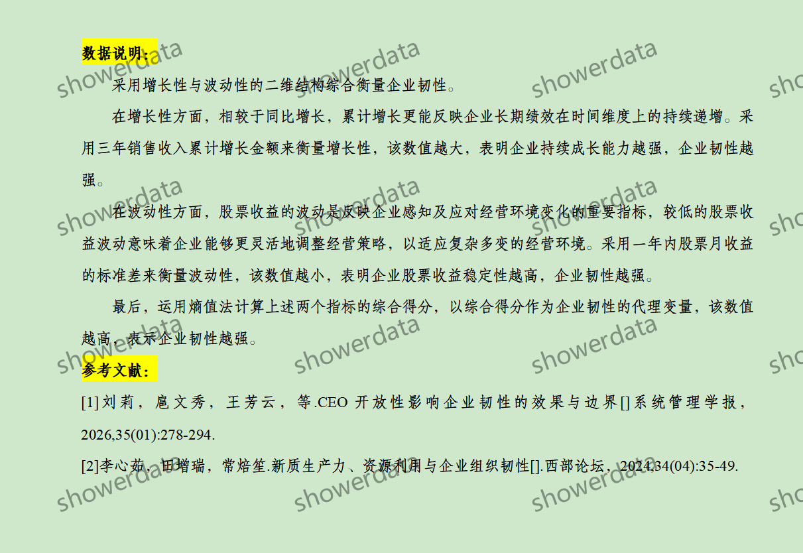
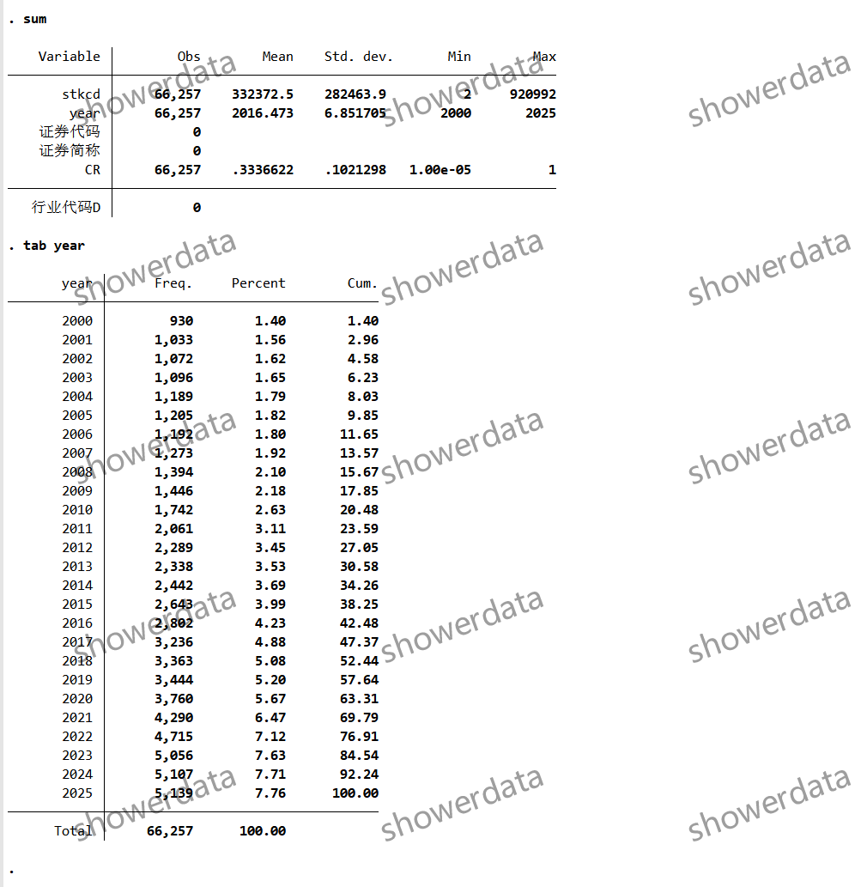
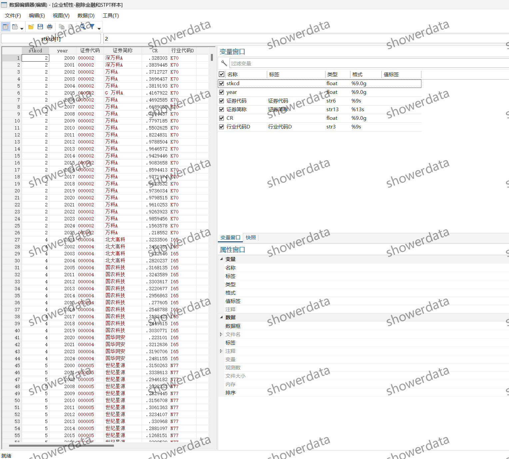
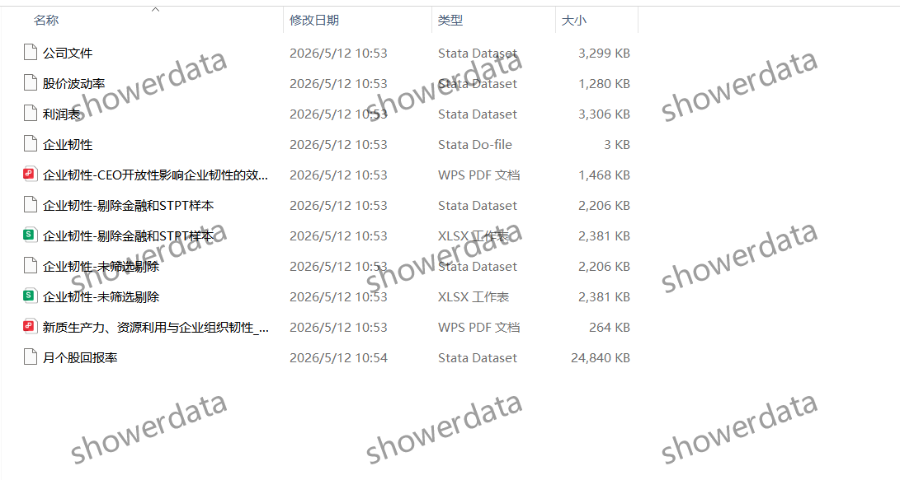

## Body

（2000-2025年）上市公司-企业韧性/组织韧性

After the purchase, there is no support for unreasonable returns. There may be missing values, please check before purchasing or ask clearly before buying!

I. Data Introduction
(1) Data Details: See the image below, please make sure to understand it before purchasing! The complete explanation has been shown, please confirm whether you need it before purchasing! No returns or exchanges will be accepted for any reason after shipment. Please confirm that you will use it before purchasing, and do not provide答疑, thank you! There may be missing values due to objective reasons, if you are not willing to buy, thank you!
(2) Data Name: List of Companies - Corporate Resilience/Organizational Resilience
(3) Sample Range: A listed company in China
(4) Time Range: 2000-2025
(5) Result Data Format: Excel, DTA
(6) Data Content: Raw data, references, Stata codes, and final results (xlsx and DTA format)

II. Data Results Indicators as Shown in the Figure

III. Methodology of Indicator Construction as Shown in the Figure

IV. References as Shown in the Figure

## Images

item_973507876511

Here is a pay link on Stripe ( https://buy.stripe.com/3cs8yP7sY87d0vu9AB ). Please contact me lonlonago@foxmail.com after funding $89, and I will send you a complete data files , thank you!

